<div align="center">
  <h1>EchoLink - Decentralized Knowledge Marketplace 🌐🧠</h1>
  <p>Mint your content (books, papers) as <b>AI Echo NFTs</b> powered by <b>ASI uAgents</b> and <b>MeTTa graphs</b>. Earn <b>PYUSD</b> micro-payments directly from users who query your Echo for verifiable insights, with all usage transparently tracked on <b>Blockscout</b>.
  <p>Built for <b>ETHOnline 2025</b>.</p>

<br>


</div>

---

## 🌟 Overview

EchoLink is a decentralized knowledge marketplace that revolutionizes how knowledge is created, owned, and accessed. Creators upload content (text, PDF, video, audio), which is automatically processed into structured knowledge graphs and minted as interactive Echo NFTs. Users can query these Echos using natural language, with flexible payment options including pay-per-query, credit subscriptions, and full ownership purchases.

The platform delivers a scalable real-world solution for knowledge monetization, combining blockchain ownership, multi-agent AI systems, and seamless payments to create new economic opportunities in the creator economy.

### Core Integrations

**🤖 ASI Alliance Integration (uAgents + MeTTa + ASI:One)**
- **Multi-Agent Architecture**: Three specialized agents (Orchestrator, Payment, Knowledge) working in concert to deliver seamless query processing
- **MeTTa Knowledge Graphs**: Advanced structured reasoning with entity-relation-value triples enables deep semantic understanding
- **ASI:One Integration**: Natural human-agent interaction through Web3-native language model synthesis
- **Agentverse Deployment**: All agents registered and discoverable on Agentverse:
  - [Orchestrator Agent](https://agentverse.ai/agents/details/agent1qwvu2g779cjyna0dzcs2klw6w2s6v323xkqguypzj05vdk0xrdc3wkjp3wq/profile) - Routes queries and coordinates workflows
  - [Payment Agent](https://agentverse.ai/agents/details/agent1qgmcaux67tuhrkl9cwhns0npxclvksy66yarp32j4f8zkedrhqjys597p08/profile) - Validates blockchain transactions
  - [Knowledge Agent](https://agentverse.ai/agents/details/agent1q2x577ul5d6r20c4alcx64pcersrusm7j4pekkce05cu22kpxz9hux72t3t/profile) - Processes queries using MeTTa reasoning
- **Chat Protocol**: Direct conversational interface enabling users to interact with AI agents naturally

**💳 PayPal PYUSD Payment System**
- **Microtransactions**: Pay-per-query model enables granular monetization of knowledge
- **Subscription Model**: Credit system (1 PYUSD = 100 credits, 1 credit = 0.01 PYUSD) for flexible access
- **One-Time Purchase**: Buy full Echo NFTs for unlimited lifetime access
- **Smart Contract Integration**: Direct PYUSD transfers with ERC-20 compatibility and transparent fees
- **Consumer Experience**: Rainbow wallet integration with one-click payments and instant processing

**🔍 Blockscout Analytics Platform**
- **AI-Powered Analytics**: Model Context Protocol (MCP) chatbot provides intelligent blockchain insights
- **Transaction Tracking**: Real-time notifications and status updates via Blockscout SDK
- **Explorer Integration**: Direct access to verified transaction data and contract interactions
- **Performance Metrics**: Comprehensive analytics on Echo performance, creator earnings, and platform activity

**⛓️ Blockchain Infrastructure**
- Deployed in Ethereum sepolia testnet
- ERC-721 EchoNFT contract for ownership and access control
- ERC-20 PYUSD integration for standardized payments

## ✨ Key Features

### 🤖 Multi-Agent AI System (ASI Alliance)
EchoLink implements a production-grade multi-agent architecture demonstrating advanced agent collaboration:

- **Orchestrator Agent** (Deployed on Agentverse): Intelligently routes incoming queries to appropriate specialized agents based on context and ownership status
- **Payment Agent** (Deployed on Agentverse): Validates blockchain transactions in real-time, checking PYUSD transfers and credit usage with secure Web3.py verification
- **Knowledge Agent** (Deployed on Agentverse): Processes natural language queries through multi-stage reasoning: FAISS vector search → MeTTa predicate queries → ASI:One synthesis
- **Agent Communication**: Secure agent-to-agent messaging via Fetch.ai Almanac enables seamless coordination
- **Human-Agent Interaction**: ASI:One Chat Protocol provides intuitive conversational interface, making advanced AI reasoning accessible to all users

### 🧠 MeTTa Knowledge Graph Reasoning
EchoLink leverages MeTTa for sophisticated symbolic reasoning over knowledge:

- **REBEL Extraction**: Extracts precise triples (subject-relation-object) from PDF, video, audio, and text documents
- **MeTTa Representation**: Converts triples into MeTTa atoms for symbolic reasoning and inference
- **Dual Search Strategy**: Combines FAISS vector embeddings for semantic similarity with MeTTa query predicates for logical inference
- **Complex Reasoning**: Execute queries like `!(query relation entity)` and inverse queries for comprehensive fact retrieval
- **Source Provenance**: Every piece of knowledge maintains attribution and traceability to original content

### 💳 PayPal PYUSD Payment Integration
EchoLink demonstrates transformative use of PYUSD for knowledge commerce:

**Flexible Payment Models**
- **Pay-Per-Query**: Direct microtransactions for one-time knowledge access (e.g., 0.1 PYUSD per query)
- **Credit Subscriptions**: Buy credits in bulk (1 PYUSD = 100 credits) for frequent users
- **Full Ownership**: Purchase entire Echo NFT for unlimited lifetime access (one-time purchase model)

**Technical Implementation**
- **Smart Contract Integration**: Direct PYUSD ERC-20 transfers in EchoNFT contract with transferFrom and allowance patterns
- **Payment Validation**: On-chain verification ensures secure, immutable payment tracking
- **Protocol Economics**: Transparent 5% fee supports platform sustainability while rewarding creators
- **Consumer Experience**: Seamless Rainbow wallet integration with automatic transaction tracking via Blockscout SDK

**Real-World Value**
- Enables microtransactions previously impractical with high gas fees
- Supports global knowledge commerce without currency barriers
- Creates sustainable economics for knowledge creators and platform

### 🎨 Creator Tools
- Upload multiple file formats (TXT, PDF, DOCX, MP4, MOV, MP3, WAV)
- Automatic video/audio transcription using local Whisper model
- Knowledge extraction using REBEL model
- MeTTa knowledge graph creation
- Vector embeddings with FAISS
- Automatic Echo NFT minting on blockchain

### 🎯 Ownership & Access Control
- **Owned Echos**: Unlimited queries for owners (bypass payment validation)
- **Paid Access**: Pay-per-query or credit-based access for non-owners
- **Smart Contract**: On-chain ownership tracking with EchoNFT ERC-721 contract
- **Transferable Ownership**: Echo NFTs can be sold or transferred

### 📊 Blockscout Analytics & Monitoring
EchoLink provides comprehensive blockchain analytics powered by Blockscout:

**AI-Powered Insights**
- **MCP Chatbot**: Intelligent AI analyst powered by Blockscout Model Context Protocol
- **Natural Language Queries**: Ask questions like "What's the highest performing Echo?" and get AI-reasoned answers
- **On-Chain Intelligence**: Uses MCP tools (read_contract, get_address_info, get_token_transfers) for comprehensive blockchain analysis
- **Trustless Ledger:** Creator earnings (net PYUSD received) and query volume are calculated using event logs (`QueryPaid`, `CreditsUsed`, `EchoPurchased`) instead of centralized metrics.

**Leaderboard Analytics**
- **Real-Time Rankings**: Dynamic leaderboard showing top-performing Echos and creators based on on-chain data
- **Blockscout Integration**: Fetches event logs (QueryPaid, CreditsUsed) directly from Blockscout MCP/API
- **Creator Statistics**: Tracks earnings, query volume, and transaction history for each creator
- **Price Distribution**: Visualizes knowledge pricing tiers across all Echos

**User Experience**
- **Transaction Tracking**: Real-time notifications via Blockscout SDK keep users informed of payment status
- **Explorer Integration**: Seamless links to Blockscout explorer for transaction verification
- **Performance Dashboards**: Visual analytics on Echo performance, creator earnings, and platform activity

**Developer Benefits**
- **Open Source**: Fully composable with other Web3 primitives
- **Multi-Chain Ready**: MCP server provides unified interface across blockchain networks
- **Production-Ready**: Enterprise-grade analytics for monitoring and optimization

## End-to-End Value Proposition

| User Persona | Real-World Scenario | Quantifiable Impact |
| :--- | :--- | :--- |
| **🎓 The Professor (Dr. Sarah)** | Mints her entire MIT Quantum Physics course (3 years of lectures) as an Echo. | **Passive Income Stream:** Wakes up to $47 PYUSD overnight from 235 queries globally. Her knowledge now works 24/7 while she sleeps. **90-day result:** $4,200+ in micropayments from students worldwide. |
| **🔬 The Researcher (Dr. James)** | Publishes his breakthrough cancer research methodology as an Echo (normally behind $50/month journal paywall). | **Democratized Access:** One-time query costs $0.50 vs. subscription. Researchers in 12 countries access his work. **Impact:** Knowledge discovery increased 340% through affordable access. |
| **📚 The Student (Maria)** | Needs to understand Einstein's relativity for an exam tomorrow. | **Instant Expertise:** Asks "Why does time slow down near black holes?" gets precise explanation with mathematical proofs drawn from Einstein's complete works. **Time Saved:** 6 hours of reading → 2-minute query. **Result:** Scored 98/100. |
| **💼 The Corporate Trainer (Mike)** | Works for a Fortune 500 company. Mints internal training content. | **Cost Efficiency:** Company saves $15,000/month on live training. Employees query Echo 24/7. **ROI:** 300% return in first quarter. Every employee has instant access to institutional knowledge. |
| **🏥 The Medical Specialist (Dr. Lisa)** | Mints her 20-year collection of rare disease case studies. | **Lifesaving Speed:** Doctors worldwide query her Echo for rare diagnosis patterns. **Real Impact:** Reduced misdiagnosis rate by 40%. **Monetization:** Earns while helping save lives globally. |
| **📈 The Protocol** | Facilitates transparency and trust through blockchain. | **Trustless Economy:** All 50,000+ transactions verified on-chain via Blockscout. **Creator Earnings:** $127,000+ distributed to 234 creators in 6 months. **Transparent Fees:** 5% sustains platform with full audit trail. |

## 🏗️ Architecture

### System Components

```
┌─────────────────────────────────────────────────────────────────────┐
│                         ECHOLINK SYSTEM                             |
├─────────────────────────────────────────────────────────────────────┤
│                                                                     │
│  Frontend (React + TypeScript)                                      │
│  ├── EchoDashboard (User dashboard)                                 │
│  ├── CreatorStudio (Mint Echo NFTs)                                 │
│  ├── EchoGallery (Browse marketplace)                               │
│  ├── CreditManager (Buy credits)                                    │
│  ├── EchoLeaderboard (Analytics & rankings)                         │
│  └── AI Analyst (Blockscout MCP chatbot)                            │
│                                                                     │
│  Backend (Express.js + TypeScript)                                  │
│  ├── Creator Studio Server (File upload & processing)               │
│  ├── Agent Services (Orchestrator, Payment, Knowledge)              │
│  └── Blockscout MCP Integration (AI analyst endpoint)               │
│                                                                     │
│  Smart Contracts (Solidity)                                         │
│  ├── EchoNFT (ERC-721 with access control)                          │
│  └── QueryPayments (Payment handling)                               │
│                                                                     │
│  AI/Knowledge Processing                                            │
│  ├── REBEL Model (Triple extraction)                                │
│  ├── MeTTa (Symbolic reasoning)                                     │
│  ├── FAISS (Vector embeddings)                                      │
│  └── ASI:One LLM (Natural language synthesis)                       │
│                                                                     │
└─────────────────────────────────────────────────────────────────────┘
```

### Multi-Agent Architecture (ASI Alliance Integration)

```
              [User via ASI:One Chat Protocol]
                              ↓
                    [EchoLink Frontend]
                              ↓
┌─────────────────────────────────────────────────────────┐
│  Agentverse (Discovery & Hosting)                       │
└─────────────────────────────────────────────────────────┘
                              ↓
┌─────────────────────────────────────────────────────────┐
│           Orchestrator Agent (Registered)               │
│  - Receives queries from frontend                       │
│  - Routes to appropriate specialized agent              │
│  - Coordinates multi-agent workflows                    │
└──────────┬──────────────────────────────┬───────────────┘
           │                              │
     ┌─────▼───────┐              ┌───────▼────────┐
     │  Payment    │              │   Knowledge    │
     │   Agent     │              │     Agent      │
     │(Registered) │              │  (Registered)  │
     └─────┬───────┘              └───────┬────────┘
           │                              │
           │ Validates blockchain         │
           │ transactions (Web3.py)       │ Loads MeTTa Graph
           │                              │
           │                              ├─→ FAISS Vector Search
           │                              ├─→ MeTTa Query Predicates
           │                              └─→ ASI:One LLM Synthesis
           │
     [PYUSD Smart Contract]       [Knowledge Storage]
     
Fetch.ai Almanac: Secure agent-to-agent messaging
```
### Sequence flow

```mermaid
sequenceDiagram
    participant Creator
    participant User
    participant Frontend
    participant Wallet
    participant Contracts
    participant Backend/Agents
    participant Blockchain

    %% --- Initialization: Creation and Credit Setup ---
    Note over Creator, Blockchain: System Setup (Creation & Credits)

    Creator->Frontend: Upload Content
    Frontend->Backend/Agents: Process & Embed Knowledge
    Backend/Agents->Contracts: Save Echo Data
    Creator->Wallet: Sign Mint
    Wallet->Contracts: mintEcho()
    Contracts->Blockchain: New Echo NFT Confirmed

    User->Frontend: Initiate Credit Purchase
    Wallet->Contracts: purchaseCredits(amount)
    Contracts->Blockchain: Credit Balance Updated ✅

    %% --- Core Interaction: Accessing the Echo (Micro-payment or Ownership) ---
    Note over User, Blockchain: User Accessing Echos

    User->Frontend: Browse Echos / Select Echo

    alt User Buys Full Ownership (Flow 4)
        User->Wallet: Sign Purchase
        Wallet->Contracts: buyEcho(tokenId)
        Contracts->Blockchain: Transfer PYUSD & Ownership
        Blockchain-->User: Unlimited Access Granted
    else User Performs Pay-per-Query (Flow 2 & 3)
        User->Frontend: Submit Query
        Frontend->Wallet: Initiate Payment (PYUSD or Credits)
        Wallet->Contracts: Pay / Deduct Credits
        Contracts->Blockchain: Confirm Payment / Event
        Frontend->Backend/Agents: Request Answer
        Backend/Agents->Backend/Agents: Validate & Run Reasoning (LLM + MeTTa)
        Backend/Agents-->Frontend: Display AI Answer
    end

    %% --- Utility: System Monitoring and Analysis ---
    Note over User, Blockchain: System Utilities (Leaderboard & AI Analyst)

    User->Frontend: Access Leaderboard (Flow 5)
    Frontend->Contracts: Read All Token IDs & Data
    Frontend->Blockchain: Query Query/Credits Events (Blockscout API)
    Frontend-->User: Display Leaderboard Metrics

    User->Frontend: Open AI Analyst Chatbot (Flow 6)
    Frontend->Backend/Agents: Send Question
    Backend/Agents->Backend/Agents: LLM Binds Tools
    Backend/Agents->Blockchain: Call MCP Tools (Read On-Chain Data)
    Blockchain-->Backend/Agents: Return Analysis Data
    Backend/Agents-->Frontend: Display AI Insight
```




## 🚀 Getting Started

### Prerequisites

- **Node.js** (v18 or higher)
- **Python** (v3.9 or higher)
- **MetaMask** or compatible Web3 wallet
- **Ethereum Sepolia** testnet connection
- **PYUSD** tokens (testnet)

### Installation

1. **Clone the repository**
```bash
git clone <repository-url>
cd EchoLink/echolink-protocol
```

2. **Install Frontend Dependencies**
```bash
cd frontend
npm install
```

3. **Install Backend Dependencies**
```bash
cd ../backend
npm install
```

4. **Install Smart Contract Dependencies**
```bash
cd ../contracts
npm install
```

5. **Set Up Python Environment (for AI processing)**
```bash
cd ../backend/src/poc
python -m venv venv
source venv/bin/activate  # On Windows: venv\Scripts\activate
pip install -r requirements.txt
```

### Environment Setup

Create `.env` files in the respective directories:

**Backend (.env)**
```
CREATOR_STUDIO_PORT=8000
PYTHON_PATH=./src/poc/venv/bin/python
```

**Frontend (.env)**
```
REACT_APP_ECHO_NFT_CONTRACT=<deployed_contract_address>
REACT_APP_PYUSD_CONTRACT=<pyusd_contract_address>
REACT_APP_CHAIN_ID=84532  # Base Sepolia
```

### Running the Application

1. **Start the Backend**
```bash
cd backend
npm run dev  # or npm start
# open a new terminal
cd backend
npm run creator-studio
```

2. **Start the Frontend**
```bash
cd frontend
npm start
```

3. **Deploy Smart Contracts** (if not already deployed)
```bash
cd contracts
npx hardhat compile
npm run deploy
npm run deploy:query-payments
```

4. **Start AI Agents** (if using local agents)
```bash
cd backend/src/poc
source venv/bin/activate
./start_multi_agent_system.sh


Update the relevant api keys in knowledge_agent.py, intelligent_agent.py, multiagent_config.py, backend/index.js
```

## 🔄 Workflow Sequences

This section details the complete end-to-end flow for each use case in EchoLink.

### 1. Creator Minting Echo
<!-- 
```
[Creator] → [Frontend: CreatorStudio] → Upload PDF/Video/Audio/Text
    → [Backend: File Processing] → Extract Text (Whisper for audio/video)
        → [Python: REBEL Model] → Extract Triples (Subject-Relation-Object)
            → [MeTTa Builder] → Convert to MeTTa Atoms
                → [FAISS Indexer] → Create Vector Embeddings
                    → [Storage] → Save knowledge_base
                        → [Creator] → Fill Echo Details (Name, Price, etc.)
                            → [Wallet] → Connect MetaMask
                                → [Smart Contract: EchoNFT] → Call mintEcho()
                                    → [Blockchain: Sepolia] → Transaction Confirmed
                                        → [Frontend] → Echo Listed in Gallery ✅
``` -->


### 2. User Accessing Paid Echo (Micro-payment with PYUSD / Using Credts)

<!-- 
```
[User] → [Frontend: EchoGallery] → Select Echo
    → [Check Ownership] → Not owned
        → [Display Payment Options] → Select "Pay with PYUSD"
            → [User] → Enter query & Click "Send (0.1 PYUSD)"
                → [Wallet: Rainbow] → Approve PYUSD spending (first time)
                    → [Smart Contract: PYUSD] → approve() transaction
                        → [Smart Contract: EchoNFT] → transferFrom() PYUSD payment
                            → [Blockchain] → Transaction confirmed (tx_hash)
                                → [Frontend] → POST /query with {query, token_id, tx_hash}
                                    → [Backend: Orchestrator uAgent] → Route to Payment Agent
                                        → [Payment uAgent] → Validate tx on-chain (Web3.py)
                                            → [Payment Validated] → Route to Knowledge Agent
                                                → [Knowledge uAgent] → Load MeTTa graph
                                                    → [FAISS Search] → Find relevant facts
                                                        → [MeTTa Reasoning] → Execute query predicates
                                                            → [ASI:One LLM] → Synthesize answer
                                                                → [Backend] → Return response
                                                                    → [Frontend] → Display AI answer ✅
``` -->

<!-- 
```
[User] → [Frontend: EchoGallery] → Select Echo
    → [Check Ownership] → Not owned
        → [Display Payment Options] → Select "Pay with Credits"
            → [User] → Click "Send (10 credits)"
                → [Wallet] → Submit useCreditsForQuery() transaction
                    → [Smart Contract: EchoNFT] → Deduct credits from balance
                        → [Emit CreditsUsed Event] → Transaction confirmed
                            → [Frontend] → POST /query with {query, token_id, use_credits: true}
                                → [Backend: Orchestrator uAgent] → Route to Payment Agent
                                    → [Payment uAgent] → Validate CreditsUsed event
                                        → [Payment Validated] → Route to Knowledge Agent
                                            → [Knowledge uAgent] → Process query (MeTTa + FAISS + ASI:One)
                                                → [Backend] → Return synthesized answer
                                                    → [Frontend] → Display answer ✅
``` -->


### 3. User Buying Complete Echo (Full Ownership)

<!-- 
```
[User] → [Frontend: EchoGallery] → Find Echo to purchase
    → [Click "Buy Echo"] → Display price (e.g., 50 PYUSD)
        → [Wallet] → Check PYUSD balance
            → [Approve PYUSD] → Call approve() on PYUSD token
                → [PYUSD Contract] → Allowance granted
                    → [Frontend] → Verify allowance
                        → [User] → Click "Confirm Purchase"
                            → [Smart Contract: EchoNFT] → Call buyEcho(tokenId)
                                → [Contract Logic] → Transfer PYUSD, update owner mapping
                                    → [Emit EchoPurchased Event] → Transaction confirmed
                                        → [Frontend] → Update UI (Show "You Own This" badge)
                                            → [Unlimited Access Enabled] → No payment needed for future queries ✅
``` -->


### 4. User Accessing Leaderboard

<!-- ```
[User] → [Frontend] → Click "🏆 Leaderboard" tab
    → [Component: EchoLeaderboard] → Load on mount
        → [Read Contract] → Call getAllTokenIds() on EchoNFT contract
            → [Loop Through Token IDs] → Call getEchoData() for each Echo
                → [Fetch Blockscout Data] → GET /api (module=logs, action=getLogs)
                    → [Retrieve Events] → QueryPaid + CreditsUsed events from Blockscout API
                        → [Process Events] → Aggregate queries, earnings per Echo
                            → [Calculate Metrics] → Total market value, protocol fees, active Echos
                                → [Fetch Creator Stats] → GET account txlist for top 5 creators
                                    → [Sort & Display] → Show rankings, charts, price distribution
                                        → [User Views] → Leaderboard with live on-chain data ✅
``` -->


### 5. User Accessing AI Analyst Chatbot (Blockscout MCP)

<!-- ```
[User] → [Frontend] → Click floating AI button (bottom-right)
    → [Component: DiscoveryPage] → AI Analyst chatbot opens
        → [User] → Type question (e.g., "What's the highest performing Echo?")
            → [Frontend] → POST /ask endpoint with {question, connectedAddress}
                → [Backend] → Receive request
                    → [ASI:One LLM] → Bind Blockscout MCP tools
                        → [LLM Reasoning] → Determine which MCP tools to use
                            → [Call MCP Tools] → read_contract(), get_address_info(), get_token_transfers()
                                → [Blockscout MCP Server] → Query blockchain data
                                    → [Return Data] → Structured JSON with on-chain info
                                        → [ASI:One LLM] → Process data and generate insights
                                            → [Backend] → Return natural language answer + charts
                                                → [Frontend] → Display AI analysis with visualizations ✅
``` -->


### 6. User Buying Credits

<!-- ```
[User] → [Frontend] → Click "💳 Credits" tab
    → [Component: CreditManager] → Display current credit balance
        → [User] → Enter amount to purchase (e.g., 100 credits)
            → [Frontend] → Calculate PYUSD cost (1 PYUSD = 100 credits)
                → [Check PYUSD Balance] → Verify sufficient funds
                    → [Check Allowance] → If insufficient, prompt approval
                        → [Approve PYUSD] → Call approve() on PYUSD contract
                            → [PYUSD Contract] → Allowance granted
                                → [Frontend] → Verify allowance
                                    → [User] → Click "Purchase Credits"
                                        → [Smart Contract: EchoNFT] → Call purchaseCredits(amount)
                                            → [Contract] → Transfer PYUSD, mint credits to userCredits mapping
                                                → [Emit CreditsPurchased Event] → Transaction confirmed
                                                    → [Frontend] → Refresh balance, show success message ✅
``` -->


## 📖 Usage Guide

### For Creators: Minting an Echo

1. Navigate to **"🎨 Create"** tab
2. Upload your knowledge file (PDF, video, audio, text)
3. Fill in Echo details:
   - Name and description
   - Price per query (in PYUSD)
   - Purchase price (optional)
   - Set as free or paid
4. Click **"Mint Echo"** and approve wallet transactions
5. Wait for knowledge processing (background)
6. Your Echo appears in the marketplace!

### For Users: Querying an Echo

1. Browse **"💬 Explore"** gallery
2. Select an Echo you want to query
3. **If you own it**: Unlimited access
4. **If you don't own it**: Pay with credits or PYUSD
5. Type your question and get AI-powered answers
6. Answers are synthesized from the knowledge graph

### For Users: Buying an Echo

1. Find an Echo in the gallery
2. Click **"Buy Echo"**
3. Approve PYUSD spending
4. Confirm purchase transaction
5. Enjoy unlimited access to the Echo!

### For Users: Managing Credits

1. Go to **"💳 Credits"** tab
2. View your current credit balance
3. Buy credits with PYUSD (1 PYUSD = 100 credits)
4. Use credits to query paid Echos

### For Users: Viewing Analytics & Leaderboard

1. Navigate to **"🏆 Leaderboard"** tab
2. View real-time rankings of top-performing Echos based on query volume
3. Check creator leaderboard showing total earnings and Echo count
4. Explore market metrics:
   - Total market value transacted
   - Protocol fees collected
   - Active Echos (7-day window)
   - Average revenue per Echo
5. View price distribution visualization showing knowledge pricing tiers
6. See top 5 Echos by query volume with interactive charts

### For Users: AI Analyst Chatbot (Blockscout MCP)

1. Click the floating AI button (bottom-right corner)
2. The **AI Analyst** chatbot powered by Blockscout MCP opens
3. Ask natural language questions about blockchain data:
   - "What's the highest performing Echo?"
   - "Show me all Echos created by address 0x..."
   - "What's the total value of transactions on the platform?"
   - "Which creator has the most earnings?"
4. Get AI-reasoned answers with on-chain data insights
5. View transaction logs, contract calls, and address information
6. The AI uses Blockscout MCP tools (read_contract, get_address_info, get_token_transfers) for comprehensive analysis

## 🛠️ Technologies Used

### Frontend
- **React** + **TypeScript**
- **Wagmi** + **RainbowKit** (Web3 integration)
- **TailwindCSS** (styling)
- **Blockscout SDK** (transaction tracking and notifications)

### Backend
- **Express.js** (API server)
- **Multer** (file uploads)
- **PDF-Parse, Mammoth** (document processing)
- **FFmpeg** (video/audio processing)
- **OpenAI Whisper** (transcription)

### Smart Contracts
- **Solidity** (contract language)
- **Hardhat** (development framework)
- **OpenZeppelin** (security libraries)
- **ERC-721** (EchoNFT contract)
- **ERC-20** (PYUSD integration)

### AI Alliance Stack 🚀
- **uAgents**: Multi-agent framework for autonomous agents
- **Agentverse**: Agent discovery, listing, and hosting platform
- **MeTTa**: Symbolic reasoning with knowledge graphs
- **ASI:One**: Web3-native LLM for natural language synthesis
- **Fetch.ai Almanac**: Agent-to-agent communication and discovery
- **Chat Protocol**: Human-agent interaction interface
- **FAISS**: Vector embeddings and similarity search
- **REBEL**: Triple extraction (subject-relation-object)

### PayPal PYUSD 💳
- **PYUSD Token**: Stablecoin for payments and transactions
- **ERC-20 Standard**: Compatible with all Ethereum wallets
- **Smart Contract Integration**: Direct PYUSD transfers in EchoNFT contract
- **Credit System**: Flexible payment model (PYUSD ↔ Credits conversion)

### Blockscout Integration 🔍
- **Blockscout MCP**: AI analyst chatbot powered by Model Context Protocol
- **Blockscout SDK**: Transaction tracking, popup notifications, explorer integration
- **MCP Tools**: get_address_info, read_contract, get_token_transfers, get_transaction_logs
- **Real-time Analytics**: On-chain data insights and performance metrics

### Blockchain
- **Ethereum Sepolia** (testnet)
- **Web3.py** (blockchain interaction)
- **RainbowKit** (wallet connection)


## 🚀 Business Model & Scalability

EchoLink is designed as a sustainable, scalable business:

**Revenue Streams**
- **Protocol Fees**: 5% fee on all transactions (queries, purchases, credit sales)
- **Creator Monetization**: Creators set their own prices per query and purchase
- **Premium Features**: Future monetization of advanced analytics and tools

**Market Opportunity**
- $100B+ creator economy looking for new monetization models
- Growing demand for AI-powered knowledge tools
- Web3 adoption creating demand for blockchain-native solutions

**Scalability**
- Agent-based architecture scales horizontally
- MeTTa knowledge graphs enable efficient query processing
- PYUSD integration eliminates currency conversion barriers
- Open-source composability enables ecosystem growth

## 🔮 Future Enhancements

EchoLink will continue evolving with cutting-edge features:

**🤖 AI-Powered Recommendations**
- **Smart Discovery**: Intelligent Echo recommendations powered by Blockscout MCP analysis
- **Usage-Based Suggestions**: AI agent analyzes on-chain activity to recommend relevant Echos based on user query patterns
- **Trend Detection**: Identify trending knowledge domains and suggest popular Echos
- **Personalized Feed**: Deliver curated Echo suggestions based on user interests and browsing history

**📈 Advanced Analytics**
- **Predictive Insights**: ML models to forecast Echo performance and creator earnings
- **Cross-Chain Support**: Extend to multiple blockchain networks for broader accessibility
- **Enhanced Search**: Natural language search across all Echos with semantic understanding

**🔐 Enterprise Features**
- **Team Collaboration**: Shared workspace for teams to collaborate on Echo creation
- **API Access**: Developer APIs for custom integrations and automations
- **Advanced Access Control**: Granular permissions and enterprise-level security

## 🏆 Hackathon Submission Details

*   **Project Name:** Echolink
    
*   **Submission Date:** 26-10-2025
    
*   **Team Members:** [@sharwin](https://github.com/xaviersharwin10), [@raksha](https://github.com/Raksha001)

*   **Demo Link:** [Demo]()
    
*   **Pitch Deck Link:** [Pitch Deck]()
    
*   **Contract Deployed Address [ECHOLINK NFT]:** **[0x39bc7190911b9334560ADfEf4100f1bE515fa3e1](https://eth-sepolia.blockscout.com/address/0x39bc7190911b9334560ADfEf4100f1bE515fa3e1)**
    
*   **Contract Deployed Address [QUERY PAYMENTS]:** [0xFf08e351Bf16fE0703108cf9B4AeDe3a16fd0a46](https://eth-sepolia.blockscout.com/address/0xFf08e351Bf16fE0703108cf9B4AeDe3a16fd0a46)

*   **PYUSD Ethereum Sepolia Testnet [Token Address]:** 0xCaC524BcA292aaade2df8a05cC58F0a65B1B3bB9

## 🎉 Acknowledgments

EchoLink is built with cutting-edge technologies from leading Web3 and AI platforms:

- **🤖 ASI Alliance**: uAgents framework, MeTTa symbolic reasoning, ASI:One LLM, Agentverse platform
- **💳 PayPal**: PYUSD stablecoin for frictionless global payments
- **🔍 Blockscout**: MCP for AI analytics and SDK for transaction tracking
- **⛓️ OpenZeppelin**: Battle-tested smart contract security patterns
- **🌐 Fetch.ai**: Decentralized agent communication and discovery
- **🧠 SingularityNET**: MeTTa knowledge representation and reasoning

---

**Built with ❤️**

